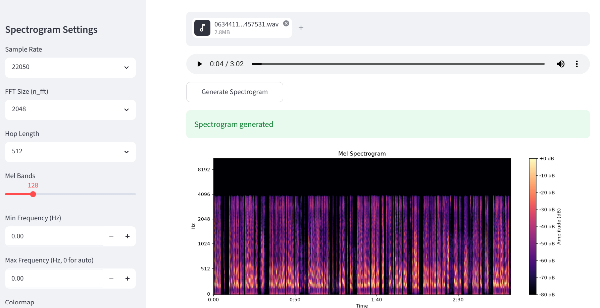

# Audio-Visualizer

Generate a mel spectrogram visualization from a short audio file using Python.

## Features

- Loads `.wav`, `.mp3`, and other formats supported by `librosa`.
- Converts audio into a mel spectrogram.
- Saves the visualization as an image (`.png` by default).
- Supports tunable FFT, hop size, mel bands, and frequency range.
- Includes a web UI for upload, preview, and download.

## Project Files

- `visualizer.py` - Core spectrogram logic and CLI script.
- `app.py` - Streamlit UI for interactive visualization.
- `requirements.txt` - Python dependencies.

## Setup

1. Create and activate a virtual environment.

PowerShell:

```powershell
python -m venv .venv
.\.venv\Scripts\Activate.ps1
```

2. Install dependencies.

```powershell
pip install -r requirements.txt
```

## Usage (CLI)

Basic usage:

```powershell
python visualizer.py path\to\audio.wav
```

This saves the output to `output/mel_spectrogram.png`.

Custom output path:

```powershell
python visualizer.py path\to\audio.wav --output output\my_mel.png
```

With custom settings:

```powershell
python visualizer.py path\to\audio.wav --n-mels 256 --n-fft 4096 --hop-length 256 --fmin 50 --fmax 12000 --cmap viridis
```

Visualize only the first 10 seconds:

```powershell
python visualizer.py path\to\audio.wav --max-duration 10
```

## Usage (UI)

Run the Streamlit app:

```powershell
streamlit run app.py
```

Then open the local URL shown in the terminal (usually `http://localhost:8501`), upload an audio file, tune settings, and generate/download the spectrogram PNG.

## Sample Output



## Notes

- If `python` points to Python 2 on your system, use `python3` instead.
- For MP3 support, make sure your environment has appropriate audio decoding support.
